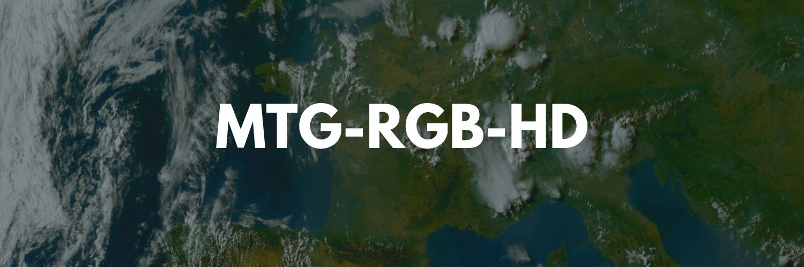

# MTG-RGB-HD

<p align="center">
  
</p>

**Near-real-time EUMETSAT satellite imagery viewer and export tool**

MTG-RGB-HD is a web application to visualize and export Meteosat Third Generation
(MTG) satellite imagery from EUMETSAT with multi-layer blending. The default view
is centered on France; the map can be freely panned over Europe and Africa.

---

## Features

### Layer Control

- **Independent layer toggles** for RGB, VIS (0.6 µm), and IR (10.5 µm)
- **7 visualization modes**:
  - RGB (True Color)
  - VIS (Visible/Reflective)
  - IR (Thermal/Infrared)
  - RGB + VIS (HD – luminosity blend)
  - VIS + IR (Sandwich mode)
  - RGB + IR (Cloud-only)
  - RGB + VIS + IR (Hybrid)

### Adjustments & Refinement

Context-aware image adjustments panel — each control is only shown when it
actually affects the currently active layer combination:

- VIS contrast and brightness fine-tuning
- RGB color saturation control
- Algorithmic HD enhancement for RGB+VIS, with 4 presets (**Natural**,
  **Balanced**, **Punchy**, **Analyze**) plus a fully **Custom** mode exposing
  sharpen, local contrast, highlight/shadow protection, noise reduction, and
  saturation as individual sliders
- VIS contribution weighting (when blending with RGB)
- IR/Sandwich intensity modulation
- IR visualization style (Style 01, Style 02, Grayscale)
- Automatic VIS attenuation during night hours, based on real solar elevation
  at the map's center
- One-click reset to defaults (adjustments panel or the `R` shortcut)

### Geographic Overlays

Enhance your view with map overlays:

- **Country borders** (white lines, adjustable opacity)
- **France departments** (light blue lines for administrative divisions)
- **City labels**: major European cities rendered as an exact-position dot
  plus name, with a zoom- and population-aware decluttering pass so nearby
  conurbations (e.g. Lille/Antwerp, the Rhine-Ruhr area) don't overlap into
  unreadable clutter

### Export & Download

- **Still image export** with smart preselection based on the active layer
  combination:
  - VIS 0.6 µm single layer
  - RGB True Color single layer
  - RGB + VIS composite (luminosity blend), optionally with HD enhancement
    applied
  - Sandwich (VIS + IR) and Hybrid (RGB + VIS + IR), when those layers are
    active
- **Pre-export preview thumbnails** for every selected format, rendered from
  the exact same pipeline as the final export (not an approximation), shown
  as large cards with the layer badge and label overlaid
- **Format choice**: PNG (lossless) or JPEG (quality 92%)
- **Resolution choice**: 1920 / 2560 / 4096 px on the longer side — this is a
  genuine WMS re-render at the requested size, not a browser-side upscale, so
  higher resolutions carry real extra detail
- **Direct single-file download** when exactly one format is selected;
  otherwise all selected formats are bundled into one ZIP
- **Progress bar** covering the whole pipeline (WMS fetch → compositing →
  per-file encoding → ZIP packaging when applicable)
- **GIF animation export** with advanced controls:
  - Custom UTC day selection with bounded start/end range on a single timeline
  - Fixed 10-minute sampling (no frame skipping)
  - Up to **73 frames** (full 12-hour window)
  - GIF color count (64 / 128 / 256)
  - Palette mode: per-frame or global palette
  - Dithering levels: none / low / medium / high
  - Export progress integrated in the export button
- **Bilingual export labels** (French/English)
- **Overlay integration** – borders, departments, cities, a date/layer info
  badge, and a source watermark are rendered directly into exported images,
  scaled to stay legible at every export resolution
- **Resolution- and timestamp-tagged filenames** (e.g.
  `RGB_VIS_2560x1312_2026-07-03_08-10.png`) — the filename preview shown in
  the download modal always matches the file you actually get

### User Experience

- **Real-time time selection** in 10-minute UTC increments
- **Map memory**: last map position (center/zoom) is restored after refresh/revisit
- **Share button** to generate a URL that reopens the same view (time, map
  position, active layers, all adjustment values, theme, and language)
- **Keyboard shortcuts**:
  - Left/Right: -/+ 10 minutes · Shift + Left/Right: -/+ 30 minutes ·
    Ctrl/Cmd + Left/Right: -/+ 60 minutes
  - `L`: jump to the latest available time
  - `A`: toggle the animation (GIF) modal
  - `D`: open the download modal
  - `S`: toggle the adjustments panel
  - `I`: toggle the info modal
  - `R`: reset adjustments to defaults
  - `Shift` + `S`: copy a share link
  - `?`: toggle the help modal
- **Quick help modal** with shortcut and HD enhancement guidance
- **Tile loading progress indicator** with percentage and pending tile count
- **Light/Dark/Auto theme support**
- **Bilingual interface** (FR/EN)
- **Responsive, mobile-first design**: the header collapses to a compact
  two-row layout on phones, with secondary controls (language, theme,
  help/info) tucked behind a single overflow menu; touch targets are sized to
  Apple's 44px HIG minimum on mobile

---

## Performance Optimizations

- Initial map view constrained to France to minimize tile loading
- Dedicated export map instance isolates tile requests from the display map
- Leaflet `keepBuffer` and `updateWhenIdle` enabled for smoother interaction
- LRU cache for cloud-only IR tiles (hybrid-related modes)
- City labels rendered only on visible map
- Efficient canvas compositing for multi-layer exports

---

## Tech Stack

| Layer | Technology |
| --- | --- |
| **Frontend** | React 19 + TypeScript (strict mode) |
| **Build** | Vite 6 |
| **Server** | Express (Vite middleware in dev, static + SPA fallback in production) |
| **Maps** | Leaflet (WMS tile layers), driven imperatively — no react-leaflet |
| **Export** | JSZip + file-saver + Canvas API + gifenc (GIF encoding) |
| **Styling** | Tailwind CSS v4 (`@tailwindcss/vite`, no config file) |
| **Icons** | Lucide Icons |

---

## Installation & Setup

**Prerequisites:**

- Node.js 18 or higher
- npm or yarn

**Steps:**

```bash
# Clone and install dependencies
git clone https://github.com/quentin-rey/MTG-RGB-HD.git
cd MTG-RGB-HD
npm install

# Development server
npm run dev

# Type checking (the only correctness check — there's no separate test suite)
npm run lint

# Production build (client + server bundle) and run
npm run build
npm run start

# Remove build output
npm run clean
```

Open [http://localhost:3000](http://localhost:3000) in your browser.

There is no backend or database: the Express server only serves the app (Vite
middleware in dev, static files in production) — all satellite imagery comes
directly from EUMETSAT's public WMS endpoint, and all state lives client-side
(`localStorage` plus the URL query string for shared links).

---

## Usage Guide

1. **Select Date & Time**: Use the UTC time picker at the top to choose your
   observation time (10-minute increments)
2. **Enable Layers**: Toggle RGB, VIS, and/or IR from the control bar
3. **Fine-tune**: Click "Adjustments" to access layer-specific controls
   (contrast, brightness, saturation, etc.)
4. **Add Overlays**: Enable borders, departments, and cities from the Adjustments
   panel
5. **Download**: Click "Download" to preview each available format as a
   thumbnail, pick a file format (PNG/JPEG) and resolution, then export —
   you'll get a single file directly if one format is selected, or a ZIP if
   several are

---

## Satellite Data Reference

### Bands Provided by MTG

| Band | Wavelength | Use Case | Resolution |
| --- | --- | --- | --- |
| **RGB True Color** | Visible spectrum (0.44–0.64 µm) | Natural color visualization | ~1 km |
| **VIS 0.6 µm** | 0.64 µm | Cloud detection, daytime detail | ~0.5 km (HRFI) |
| **IR 10.5 µm** | 10.5 µm | Cloud-top temperature, night analysis | ~1 km (HRFI) |

For technical documentation, see:

- [EUMETSAT Meteosat Third Generation](https://www.eumetsat.int/meteosat-third-generation)
- [EUMETSAT User Portal](https://user.eumetsat.int/)
- [MTG FCI Level 1C Data Guide](https://user.eumetsat.int/resources/user-guides/mtg-fci-level-1c-data-guide)

---

## Credits & Attribution

**Project Author:** [Quentin Rey](https://github.com/quentin-rey)

**Data Source:**

- Satellite Imagery: [EUMETSAT](https://www.eumetsat.int/) / Meteosat Third
  Generation (MTG)
- WMS Service: EUMETSAT Geoserver (view.eumetsat.int/geoserver/ows)

**Map Layers:**

- Basemap: [OpenStreetMap](https://www.openstreetmap.org/) contributors via
  [CARTO](https://carto.com/)
- Country borders: [geo-countries](https://github.com/datasets/geo-countries)
  (datasets/geo-countries)
- France departments:
  [france-geojson](https://github.com/gregoiredavid/france-geojson)
  (Grégoire David)
- City labels: [Natural Earth](https://www.naturalearthdata.com/) via
  [natural-earth-vector](https://github.com/nvkelso/natural-earth-vector)

**Libraries & Tools:**

- Mapping: [Leaflet.js](https://leafletjs.com/)
- Build Tools: [Vite](https://vitejs.dev/)
- UI Components: [Lucide React](https://lucide.dev/)
- Styling: [Tailwind CSS](https://tailwindcss.com/)

---

## License

This project is provided for **educational and informational purposes**.

- **Application Code**: Licensed under [Apache-2.0](LICENSE)
- **EUMETSAT Data**: Satellite imagery usage is subject to
  [EUMETSAT terms of use](https://www.eumetsat.int/about-us/terms-use)
- **OpenStreetMap Data**: Licensed under
  [ODbL 1.0](https://opendatacommons.org/licenses/odbl/)
