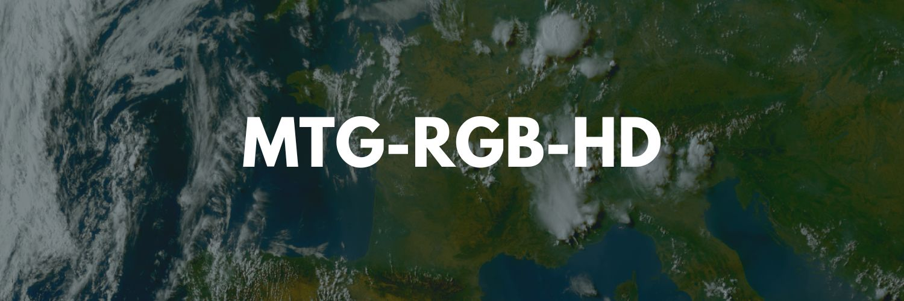

# MTG-RGB-HD

<p align="center">
  
</p>

**Near-real-time EUMETSAT satellite imagery viewer and export tool**

MTG-RGB-HD is a web application to visualize and export Meteosat Third Generation
(MTG) satellite imagery from EUMETSAT with multi-layer blending. The default view
is centered on France; the map can be freely panned over Europe and Africa.

---

## Table of Contents

- [Features](#features)
- [Tech Stack](#tech-stack)
- [Installation & Setup](#installation--setup)
- [Scripted Exports (no UI)](#scripted-exports-no-ui)
- [Usage Guide](#usage-guide)
- [Satellite Data Reference](#satellite-data-reference)
- [Credits & Attribution](#credits--attribution)
- [License](#license)

---

## Features

### Layer Control

- Independent RGB, VIS (0.6 µm), and IR (10.5 µm) toggles across **7
  visualization modes**: RGB, VIS, IR, RGB+VIS (HD), Sandwich (VIS+IR),
  Cloud-only (RGB+IR), and Hybrid (RGB+VIS+IR)
- **Fire hotspot overlay** (Fire Temperature RGB): an independent,
  always-on-top layer with live-adjustable detection thresholds (opacity,
  sensitivity, minimum brightness), toggled separately from the main layer
  combination

### Adjustments & Refinement

A context-aware panel — each control only shows up when it actually affects
the current layer combination:

- VIS contrast/brightness, RGB saturation, IR style, VIS/IR blend weighting
- Algorithmic HD enhancement for RGB+VIS, with 4 presets (Natural, Balanced,
  Punchy, Analyze) plus a fully custom mode
- Automatic night-time VIS attenuation based on real solar elevation
- One-click reset (`R`)

### Geographic Overlays

Country borders, France departments, and city labels — with a
population-aware decluttering pass so dense regions (Benelux, the Rhine-Ruhr
area) stay readable instead of turning into overlapping clutter.

### Export & Download

- **Still images** (PNG/JPEG, up to 4096px) — a genuine WMS re-render at the
  requested resolution, not a browser-side upscale — with live preview
  thumbnails and automatic ZIP bundling for multi-format selections
- **Animations** as GIF or WebM video, sharing the same time-range picker:
  up to 73 frames (a full 12h window), configurable FPS and resolution, plus
  format-specific controls (GIF palette/dithering, WebM quality)
- Borders, departments, cities, the fire hotspot layer, and a source
  watermark are baked directly into every export, at every resolution
- Resolution- and timestamp-tagged filenames that always match what you get

### User Experience

- 10-minute UTC time navigation, map position memory across visits, and a
  share button that reopens the exact same view (time, layers, adjustments,
  theme, language) via URL
- **Auto-update**: an optional toggle that follows the newest imagery as it is
  published. It only advances while you are on the latest slot, so scrubbing
  back into the past pauses it rather than dragging you forward, and its
  refreshes are silent — no loading modal interrupting a passive view
- **Freshness cue**: because the app deliberately restores the time you left
  on, an amber "past image" badge shows how far behind the view is whenever
  it isn't the latest available, and doubles as a shortcut back to live
- Every layer on screen is requested at a timestamp verified to exist for all
  of them, so RGB, VIS and IR always show the same instant even when they
  publish at different delays
- Light/Dark/Auto theme, bilingual FR/EN interface, mobile-responsive layout
- **Keyboard shortcuts**:

  | Key | Action |
  | --- | --- |
  | `←` `→` | ±10 min (Shift: ±30 min, Ctrl/Cmd: ±60 min) |
  | `L` | Jump to latest available time |
  | `A` | Open Export on the animation tab (GIF/WebM) |
  | `D` | Open Export on the still-image tab |
  | `F` | Toggle fire hotspot overlay |
  | `S` | Toggle adjustments panel |
  | `I` | Toggle info modal |
  | `R` | Reset adjustments |
  | `Shift` + `S` | Copy share link |
  | `?` | Toggle help modal |

---

## Tech Stack

| Layer | Technology |
| --- | --- |
| **Frontend** | React 19 + TypeScript (strict mode) |
| **Build** | Vite 8 (Rolldown-based bundler) |
| **Server** | Express (Vite middleware in dev, static + SPA fallback in production) |
| **Maps** | Leaflet (WMS tile layers), driven imperatively — no react-leaflet |
| **Export** | JSZip + file-saver + Canvas API + gifenc (GIF encoding) + MediaRecorder (WebM video) |
| **Styling** | Tailwind CSS v4 (`@tailwindcss/vite`, no config file) |
| **Icons** | Lucide Icons |
| **Scripting** | Playwright (headless-browser-driven exports, see [Scripted Exports](#scripted-exports-no-ui)) |

---

## Installation & Setup

**Prerequisites:**

- Node.js 18 or higher
- npm or yarn

**Steps:**

```bash
# Clone and install dependencies
git clone https://github.com/quentin-rey/MTG-RGB-HD.git
cd MTG-RGB-HD
npm install

# Development server
npm run dev

# Type checking (there's no unit-test suite; CI additionally builds the app
# and boots the built server to check it answers — see below)
npm run lint

# Production build (client + server bundle) and run
npm run build
npm run start

# Remove build output
npm run clean
```

Open [http://localhost:3000](http://localhost:3000) in your browser.

There is no backend or database: the Express server only serves the app (Vite
middleware in dev, static files in production) — all satellite imagery comes
directly from EUMETSAT's public WMS endpoint, and all state lives client-side
(`localStorage` plus the URL query string for shared links).

### Continuous integration

Every pull request must pass two required checks before it can be merged:

| Check | What it does |
| --- | --- |
| `lint` | `tsc --noEmit` — type checking, in strict mode |
| `build` | `npm run build`, then boots the built server and verifies it answers with the built page |

The `build` check exists because type checking sees none of the bundler's
module resolution, the Vite plugins or the asset pipeline — and because a
server can build cleanly and still die on startup, which has happened here
before. Pushes to `main` additionally deploy to GitHub Pages.

---

## Scripted exports (no UI)

`npm run export:composite` downloads a composite RGB+VIS(+IR) animation (GIF
or WebM) for a given UTC time range without clicking through the app. It
drives a real (headless) browser against the app via the same share-link
mechanism as "Copier lien", so it reuses the app's actual compositing/export
pipeline instead of reimplementing it — see [scripts/export-composite.ts](scripts/export-composite.ts).

```bash
npx playwright install chromium   # one-time browser download

npm run export:composite -- \
  --start 2026-08-12T19:00 --end 2026-08-12T22:00 \
  --layers rgb,vis --center 40,-10 --zoom 4 \
  --out eclipse-12aug.gif
```

Run with `--help` for the full option list (layers, format, fps, map
center/zoom, GIF/WebM quality settings). Note: since it depends on
EUMETSAT's WMS data, it can only export times that have already happened.

### Image quality & file size

By default, RGB+VIS composites can come out with flat, overexposed clouds:
the RGB+VIS blend applies a fixed +20% brightness/contrast boost to the VIS
layer before any other setting, which clips cloud tops toward pure white.
`--hd-enhance` turns on the app's own HD enhancement pipeline (same
`highlightProtection` control as the "Adjustments" panel) to pull that back
down and reveal texture — but it needs a less-clipped starting point to have
something to recover, so pair it with lower `--vis-brightness`/
`--vis-contrast`:

```bash
npm run export:composite -- \
  --start 2026-08-10T08:00 --end 2026-08-10T12:00 \
  --layers rgb,vis --center 46.6,1.9 --zoom 6 \
  --hd-enhance --hd-preset natural \
  --vis-brightness 0.85 --vis-contrast 1.0 \
  --gif-max-dimension 960 \
  --out france.gif
```

The `--hd-preset analyze` preset looks like the obvious choice for "more
detail" but is too aggressive in practice — it over-sharpens and introduces
colored fringing at cloud edges without actually recovering texture, since
the real problem is upstream clipping, not a lack of sharpening. `natural`
(gentler, higher highlight-protection ratio) combined with a lower
`--vis-brightness`/`--vis-contrast` is the better starting point; all
individual HD sliders (`--hd-strength`, `--hd-highlight-protection`,
`--hd-shadow-protection`, `--hd-local-contrast`, `--hd-sharpen`,
`--hd-saturation-adjust`, `--hd-noise-reduction`, `--hd-radius`) and
`--rgb-saturation` are also exposed for fine-tuning beyond the presets.

For file size, prefer lowering `--gif-max-dimension` over `--gif-colors`:
on a 25-frame test clip, 1280px→960px cut the file by ~40% with no visible
quality loss, while 128→64 colors only saved ~23% and introduced visible
banding on smooth gradients (terrain, ocean). `--gif-dither` trades the
opposite way — it can reduce banding at a low color count, but adds noise
that *increases* file size, so it's not a size-reduction lever.

---

## Usage Guide

1. **Select Date & Time**: Use the UTC time dock at the bottom of the map to
   choose your observation time (10-minute increments), or hit "Dernier" /
   `L` to jump to the newest available image. Turn on "Auto" there to keep
   following new imagery as it is published
2. **Enable Layers**: Toggle RGB, VIS, and/or IR from the control bar
3. **Fine-tune**: Click "Adjustments" to access layer-specific controls
   (contrast, brightness, saturation, etc.)
4. **Add Overlays**: Enable borders, departments, and cities from the Adjustments
   panel
5. **Spot fires**: Click the 🔥 button to open its own panel, enable the fire
   hotspot overlay, and tune opacity/sensitivity/brightness thresholds live
   against the current view
6. **Export**: Click "Export" to open the export modal. On the **Image** tab
   you preview each available format as a thumbnail, pick a file format
   (PNG/JPEG) and resolution, then export — a single file if one format is
   selected, a ZIP if several are. The **Animation GIF** and **Vidéo WebM**
   tabs share a time-range picker for animated exports

---

## Satellite Data Reference

### Bands Provided by MTG

| Band | Wavelength | Use Case | Resolution |
| --- | --- | --- | --- |
| **RGB True Color** | Visible spectrum (0.44–0.64 µm) | Natural color visualization | ~1 km |
| **VIS 0.6 µm** | 0.64 µm | Cloud detection, daytime detail | ~0.5 km (HRFI) |
| **IR 10.5 µm** | 10.5 µm | Cloud-top temperature, night analysis | ~1 km (HRFI) |
| **Fire Temperature RGB** | 3.8 / 2.2 / 1.6 µm composite | Wildfire detection and intensity | ~0.5 km |

For technical documentation, see:

- [EUMETSAT Meteosat Third Generation](https://www.eumetsat.int/meteosat-third-generation)
- [EUMETSAT User Portal](https://user.eumetsat.int/)
- [MTG FCI Level 1C Data Guide](https://user.eumetsat.int/resources/user-guides/mtg-fci-level-1c-data-guide)

---

## Credits & Attribution

**Project Author:** [Quentin Rey](https://github.com/quentin-rey)

**Data Source:**

- Satellite Imagery: [EUMETSAT](https://www.eumetsat.int/) / Meteosat Third
  Generation (MTG)
- WMS Service: EUMETSAT Geoserver (view.eumetsat.int/geoserver/ows)

**Map Layers:**

- Basemap: [OpenStreetMap](https://www.openstreetmap.org/) contributors via
  [CARTO](https://carto.com/)
- Country borders: [geo-countries](https://github.com/datasets/geo-countries)
  (datasets/geo-countries)
- France departments:
  [france-geojson](https://github.com/gregoiredavid/france-geojson)
  (Grégoire David)
- City labels: [Natural Earth](https://www.naturalearthdata.com/) via
  [natural-earth-vector](https://github.com/nvkelso/natural-earth-vector)

**Libraries & Tools:**

- Mapping: [Leaflet.js](https://leafletjs.com/)
- Build Tools: [Vite](https://vitejs.dev/)
- UI Components: [Lucide React](https://lucide.dev/)
- Styling: [Tailwind CSS](https://tailwindcss.com/)

---

## License

This project is provided for **educational and informational purposes**.

- **Application Code**: Licensed under [Apache-2.0](LICENSE)
- **EUMETSAT Data**: Satellite imagery usage is subject to
  [EUMETSAT terms of use](https://www.eumetsat.int/about-us/terms-use)
- **OpenStreetMap Data**: Licensed under
  [ODbL 1.0](https://opendatacommons.org/licenses/odbl/)
